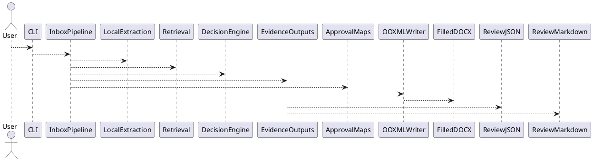
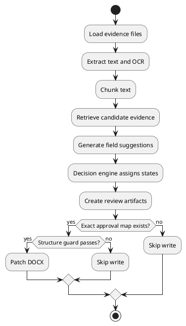
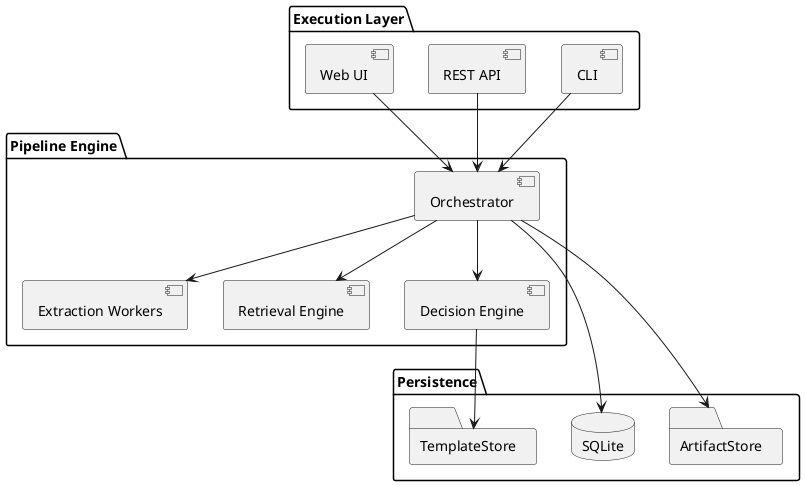

# Architecture Analysis: B2 Automation Local RAG

## Executive Summary

- **Project:** B2 Automation Local RAG
- **Primary Purpose:** Automate collection, retrieval, review, and safe insertion of audit evidence into B-2 DOCX forms.
- **Technology Stack:** Python 3.12 preferred, package metadata supports Python >=3.11, local OCR, local retrieval, DOCX OOXML patching.
- **Architecture Style:** Batch pipeline with strict safety gates.

## Overall Assessment

| Area | Rating | Notes |
|---|---:|---|
| Architecture Clarity | 9/10 | Well-structured and modular |
| Safety Controls | 10/10 | Strong guardrails before document writes |
| Code Organization | 9/10 | Clear separation of concerns |
| Extensibility | 8/10 | New forms and retrieval methods are straightforward |
| Testing Readiness | 8/10 | Dedicated tests directory and verification docs |
| Operational Complexity | 7/10 | Mostly simple local execution |
| Production Readiness | 8/10 | Suitable for contractor implementation |

## Key Strengths

- Fully local-first workflow (no paid API dependency required)
- Review-first design avoids silent automation errors
- Strict approval maps prevent unauthorized document modifications
- Strong auditability through manifests, raw artifacts, and evidence packets
- CLI-based interface supports repeatable batch processing

## Primary Risks

- Scaling to very large evidence sets may become slow
- Retrieval quality depends on heuristics unless semantic dependencies are installed
- OOXML patching can be brittle if templates change significantly
- Limited concurrency in current batch design

## High-Level Purpose

The tool automates a compliance and audit workflow:

1. Collect evidence files from an inbox.
2. Extract text and OCR scanned PDFs.
3. Chunk and retrieve relevant evidence for each form field.
4. Produce structured review packets.
5. Decide whether fields can be safely filled.
6. Write values into DOCX templates only when exact approval maps authorize them.

This architecture prioritizes trustworthiness and traceability over aggressive automation.

## Repository Structure

```text
src/b2_automation/
├── cli.py
├── inbox_pipeline.py
├── local_extraction.py
├── local_semantic_retrieval.py
├── decision_engine.py
├── approval_maps.py
├── ooxml_writer.py
├── evidence_outputs.py
├── normalizer.py
├── discover.py
├── demo.py
└── sample_pipeline.py
```

Supporting directories:

- `templates/` – DOCX templates
- `schemas/` – JSON schemas
- `tests/` – automated tests
- `samples/` – sample evidence and outputs
- `docs/` – supporting documentation
- `mapping/` – approval map data

## Architectural Style

### Batch Pipeline Architecture



Why this design works:

- Deterministic and easy to debug
- Every stage emits artifacts
- Failures are isolated and observable
- Safety checks occur before write operations

## Command-Line Interface

`cli.py` is the orchestration entry point.

Supported commands:

- `b2 inbox`
- `b2 discover`
- `b2 demo`
- `b2 sample-pipeline`

Assessment: each command delegates to a dedicated function, keeping the entrypoint thin and maintainable.

## Confirmed Repository Corrections

- Python 3.12 is preferred, while package metadata supports Python >=3.11.
- Retrieval is implemented in `local_semantic_retrieval.py` with lexical fallback.
- Semantic retrieval dependencies such as `numpy` and `scikit-learn` are optional extras.
- First-class supported forms are `B24_RL2`, `B81`, `B89`, `B90`, and `Cover_Page`.
- `docupipe_client.py` is intentionally non-default and reserved for optional experiments.

## Core Workflow Analysis

### 1) Local Extraction (`local_extraction.py`)

Responsibilities:

- Read PDFs, TXT, Markdown, JSON, CSV
- OCR scanned PDFs with Tesseract
- Extract metadata
- Chunk text for retrieval

Dependencies:

- PyMuPDF
- Pillow
- pytesseract

Output artifacts:

- `*.ocr.json`
- `*.metadata.json`
- `*.chunks.json`

Design quality: strong separation between raw extraction and downstream interpretation.

### 2) Retrieval Layer (`local_semantic_retrieval.py`)

Modes:

1. TF-IDF ranking by default (`sklearn_tfidf` or local TF-IDF cosine)
2. Keyword/lexical retrieval as fallback when scores are empty or non-positive

Optional dependencies:

- `numpy`
- `scikit-learn`

These are optional extras and are not required for default local runs.

Strengths:

- No hard dependency on ML packages
- Graceful fallback to lightweight retrieval

Improvement opportunities:

- Add embedding-based retrieval (e.g., sentence-transformers)
- Cache vector indexes

### 3) Decision Engine (`decision_engine.py`)

States:

- FILL
- LOW_CONFIDENCE
- CONFLICT
- MISSING
- BLANK

Example decision logic:

- Multiple high-confidence conflicting values → CONFLICT
- Low-confidence suggestion → LOW_CONFIDENCE
- No evidence for required field → MISSING
- Single high-confidence value → FILL

Architectural strength: this is the core trust mechanism that turns probabilistic retrieval into deterministic business decisions.

### 4) Evidence Outputs (`evidence_outputs.py`)

Generates:

- Review JSON
- Markdown summaries
- Field-level evidence packets
- Selection reports

Value: provides a complete audit trail and enables human verification.

### 5) Approval Maps (`approval_maps.py`)

Purpose: map approved field IDs to exact template locations.

Safety principles:

- Exact matches only
- No fuzzy matching
- No nearest-cell assumptions

Assessment: one of the strongest aspects of the system; it prevents accidental corruption or unauthorized writes.

### 6) OOXML Writer (`ooxml_writer.py`)

Purpose: safely patch DOCX internals.

Preconditions:

- Approval map exists
- Structure guard passes
- Decisions permit filling

Risk: template structural changes can invalidate mappings.

Recommendation: automate template fingerprinting and CI validation.

## Data Flow



## Data Model Concepts

### FieldDecision

Likely includes:

| Field | Type | Description |
|---|---|---|
| field_id | str | Unique field identifier |
| state | enum | Decision state |
| selected_value | str? | Chosen value |
| confidence | float | Confidence score |
| reason | str | Human-readable explanation |
| candidates | list | Alternative values |

### Run Manifest

Tracks all generated artifacts and execution metadata.

## Security and Compliance Review

Security strengths:

- Offline-first design reduces data leakage risk
- Immutable raw artifacts support forensic review
- Explicit write authorization minimizes unintended changes
- Human review is built into the process

Compliance fit:

- Audit evidence collection
- Regulatory documentation
- Internal controls testing
- SOC/ISO support workflows

## Performance Characteristics

Current profile:

| Stage | Expected Cost |
|---|---|
| OCR | High |
| Text chunking | Low |
| Retrieval | Medium |
| Decisioning | Low |
| DOCX patching | Low |

Scalability estimate:

- Small runs (<100 files): excellent
- Medium runs (100–1,000 files): good
- Large runs (>10,000 files): requires indexing and parallelism

## Testing and Verification

Repository includes:

- `tests/`
- `VERIFICATION.md`
- `samples/`

Recommended test categories:

- Extraction unit tests
- Retrieval scoring tests
- Decision state edge cases
- Approval map validation
- Golden DOCX regression tests

## Dependency Review

Core dependencies:

- PyMuPDF
- python-docx
- pytesseract
- Pillow
- requests
- python-dotenv

`docupipe_client.py` is non-default and should be treated as an optional experimental integration, not a core runtime path.

Observations:

- Minimal and practical dependency footprint
- Optional semantic stack avoids heavy install requirements

Recommendation: pin exact versions for production reproducibility.

## Operational Readiness

Strengths:

- CLI-friendly automation
- Structured outputs
- Deterministic runs
- Easy CI/CD integration

Missing features for enterprise deployment:

- Structured logging
- Metrics collection
- Parallel execution
- Containerization
- Configuration profiles

## Suggested Improvements (Priority Order)

These align with repository validation notes and should not alter runtime behavior until implemented.

High priority:

1. Add structured JSON logging.
2. Add template fingerprint validation.
3. Improve retrieval with embeddings.
4. Increase test coverage for OOXML patching.

Medium priority:

5. Introduce multiprocessing for OCR.
6. Add SQLite run index.
7. Support resumable pipelines.

Low priority:

8. Web UI for review artifacts.
9. Distributed execution.
10. Model-based extraction.

## Proposed Future Architecture



## Comparable Applications

- DocuSign Intelligent Insights – <https://www.docusign.com>
- Kofax TotalAgility – <https://www.kofax.com>
- UiPath Document Understanding – <https://www.uipath.com>
- OpenText Intelligent Capture – <https://www.opentext.com>

Differentiators for this project:

- Local-first
- Open and inspectable
- Focused on audit safety
- Minimal operational overhead

## Contractor Implementation Assessment

A small team could productionize quickly:

| Role | Estimated Effort |
|---|---|
| Python Engineer | 2–4 weeks |
| QA Engineer | 1–2 weeks |
| DevOps Engineer | 2–4 days |
| Domain Expert | Part-time review |

## Business Value

This system can significantly reduce:

- Manual evidence gathering time
- Copy/paste errors
- Review overhead
- Audit preparation effort

Potential ROI is high in regulated environments with recurring documentation cycles.

## Final Verdict

**Architectural Score: 9.1 / 10**

This is a thoughtfully designed, safety-oriented automation platform.

What stands out:

- Clear modular structure
- Excellent trust and approval model
- Strong auditability
- Minimal external dependencies
- Production-feasible design

Best use cases:

- Audit and assurance workflows
- Regulatory submissions
- Evidence-based document preparation
- Internal controls testing

Most important next step: enhance retrieval accuracy and add stronger template validation to reduce operational risk.

## Recommended Roadmap

Phase 1: Hardening

- Structured logging
- Version pinning
- Expanded tests
- Template fingerprinting

Phase 2: Accuracy

- Embedding retrieval
- Confidence calibration
- Better ranking

Phase 3: Operations

- Parallel OCR
- SQLite metadata index
- Web review interface
